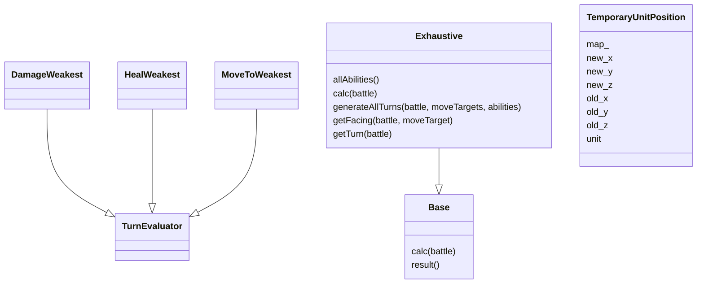

# GalaxyWizard Architecture

<!-- This file is AUTO-GENERATED by generate_uml.py — do not edit by hand.
     Regenerate with: poetry run galaxywizard-uml -->

UML diagrams of the GalaxyWizard codebase, generated with
[pyreverse](https://pylint.readthedocs.io/en/latest/additional_tools/pyreverse/index.html)
and rendered by GitHub's built-in [Mermaid](https://mermaid.js.org/) support.
The raw Mermaid sources live in [`doc/uml/`](uml/).

To regenerate after changing the code:

```bash
poetry run galaxywizard-uml
```

## Module dependencies

Import relationships between the main packages and modules. An arrow `A --> B` means *A imports B*.

```mermaid
classDiagram
  class ai {
  }
  class UnitAI {
  }
  class constants {
  }
  class engine {
  }
  class Ability {
  }
  class Battle {
  }
  class Class {
  }
  class Effect {
  }
  class Equipment {
  }
  class Faction {
  }
  class Light {
  }
  class Map {
  }
  class MapGenerator {
  }
  class Name {
  }
  class Range {
  }
  class Scenario {
  }
  class Unit {
  }
  class netsupport {
  }
  class fsm {
  }
  class gui {
  }
  class Camera {
  }
  class Clock {
  }
  class Cursor {
  }
  class GLUtil {
  }
  class Geometry {
  }
  class Input {
  }
  class MainWindow {
  }
  class MapEditorCursor {
  }
  class MapEditorGUI {
  }
  class MapEditorSprite {
  }
  class ScenarioChooser {
  }
  class ScenarioGUI {
  }
  class Sprite {
  }
  class log {
  }
  class main {
  }
  class resources {
  }
  class sound {
  }
  class translate {
  }
  class twistedmain {
  }
  class util {
  }
  UnitAI --> engine
  Ability --> engine
  Battle --> engine
  Battle --> gui
  Class --> engine
  Effect --> engine
  Effect --> gui
  Map --> engine
  MapGenerator --> engine
  Name --> engine
  Scenario --> engine
  Scenario --> Faction
  Unit --> engine
  netsupport --> engine
  Camera --> gui
  Cursor --> gui
  Cursor --> Sprite
  GLUtil --> constants
  GLUtil --> gui
  MainWindow --> gui
  MapEditorCursor --> gui
  MapEditorGUI --> engine
  MapEditorGUI --> gui
  MapEditorSprite --> gui
  ScenarioChooser --> gui
  ScenarioGUI --> engine
  ScenarioGUI --> gui
  Sprite --> engine
  Sprite --> gui
  main --> translate
  resources --> gui
  twistedmain --> UnitAI
  twistedmain --> MainWindow
  twistedmain --> ScenarioGUI
```



## Engine (`src/engine`)

Core game logic: battles, maps, units, abilities, effects, equipment and scenario handling.

```mermaid
classDiagram
  class Ability {
    abilityID : int
    get : dict
    nextID : int
    affectedUnits(map, sourceUnit, posn)
    aoe(map, sourceUnit, posn)
    correctWeapon(weapon)
    cost()
    description()
    effects()
    hasEffect(map, sourceUnit, posn)
    name()
    range(map, sourceUnit)
    rangeObject()
    requiredWeapons()
    setCopyableState(state)
    sound(weaponAbility)
    targetType()
  }
  class Armor {
  }
  class Battle {
    activeUnit : NoneType
    endingConditions
    unitQueue : list
    map()
    pickNextUnit()
    status()
    unitActed(action, x, y)
    unitCanceled()
    unitDone()
    unitMoved(x, y)
    unitSetFacing(facing)
    units()
  }
  class Class {
    abilities
    jump
    matkBase
    matkGrowth
    matkMult
    mdefBase
    mdefGrowth
    mdefMult
    mhpBase
    mhpGrowth
    mhpMult
    move
    mspBase
    mspGrowth
    mspMult
    name
    speedBase
    speedGrowth
    speedMult
    watkBase
    watkGrowth
    watkMult
    wdefBase
    wdefGrowth
    wdefMult
    addAbilities(u)
    createUnit(gender)
    equip(u)
    levelUp(u)
    spriteRoot()
  }
  class Cross {
    affectedSquares(map, unit, pos)
  }
  class Damage {
    affect(source, target)
  }
  class DamageResult {
    damage
  }
  class DamageSP {
    affect(source, target)
  }
  class DamageSPResult {
    damage
  }
  class DefeatAllEnemies {
    description()
  }
  class Defend {
    affect(source, target)
  }
  class Diamond {
    affectedSquares(map, unit, pos)
  }
  class DiamondExtend {
    affectedSquares(map, unit, pos)
  }
  class DrainLife {
    affect(source, target)
  }
  class Effect {
    affect(source, target)*
    attackIsFromFront(source, target)
    attackIsFromRear(source, target)
    attackIsFromSide(source, target)
    calcAttackAndDefense(source, target)
    calcDamage(attack, defense, maxDamage)
    estimateDamage(attack, defense)
    getDefenders(target)
  }
  class EffectResult {
    hit
    target
  }
  class EndingCondition {
    description()
  }
  class Environment {
    addLight(light)
    ambientLight()
    fogColor()
    fogDensity()
    fogEnabled()
    fogEnd()
    fogStart()
    lights()
    setAmbientLight(color)
    setFog(color, density, start, end)
    setSkyColor(color)
    skyColor()
  }
  class Equipment {
    getSprites(spriteName)
    jump()
    matk()
    mdef()
    mhp()
    move()
    msp()
    name()
    setSprites(sprites)
    speed()
    watk()
    wdef()
  }
  class Faction {
    faction()
    units()
  }
  class Foo {
    x
  }
  class HealFriendlyDamageHostile {
    affect(source, target)
  }
  class HealResult {
    damage
  }
  class Healing {
    affect(source, target)
  }
  class LastTeamStanding {
  }
  class Light {
    ambient()
    constantAttenuation()
    diffuse()
    linearAttenuation()
    position()
    quadraticAttenuation()
    specular()
  }
  class Line {
    affectedSquares(map, unit, pos)
  }
  class Map {
    height
    squares : list
    tags
    waterColor
    waterHeight
    width
    bfs(start, expand, visitPredicate, resultPredicate)
    changeCorner(x, y, corner, change)
    closestUnits(unit, faction)
    fillDistances(unit, posn)
    getPotentialConnections(square)
    getStateToCopy()
    index(x, y)
    loadString()
    reachable(unit)
    resetSearchCosts()
    save(filename)
    setCopyableState(state)
    setLoadString(text)
    shortestPath(targetX, targetY)
    smoothColors()
    squareExists(x, y)
  }
  class MapIO {
    load(mapname)
    loadString(mapname, text)
  }
  class MapSquare {
    color : list
    cornerColors : list
    cornerHeights
    guiData : dict
    search : NoneType
    smooth
    smoothed : list
    tag
    unit : NoneType
    waterColor
    waterHeight
    x
    y
    z
    height()
    maxHeight()
    minHeight()
    minusHeight(height)
    plusHeight(height)
    posn()
    posn2d()
    setColor(color)
    setTag(tag)
    setTexture(texture)
    setUnit(u)
    tagName()
    texture()
  }
  class MissResult {
  }
  class PlayerDefeated {
  }
  class Point {
  }
  class Range {
    affectedSquares(map, unit, pos)
  }
  class Scenario {
    ai()
    battle()
    lightEnvironment()
    map()
    music()
    unitFromID(unitID)
    units()
  }
  class ScenarioIO {
    load(scenarioFilename)
  }
  class Single {
    affectedSquares(map, unit, pos)
  }
  class Status {
    FREEZE : int
    HASTE : int
    INVULNERABLE : int
    MINUS_MATK : int
    MINUS_MDEF : int
    MINUS_MOVE : int
    MINUS_WATK : int
    MINUS_WDEF : int
    NUM_TYPES : int
    PARALYZE : int
    PARALYZE_ARMS : int
    PARALYZE_LEGS : int
    PLUS_MATK : int
    PLUS_MDEF : int
    PLUS_MOVE : int
    PLUS_WATK : int
    PLUS_WDEF : int
    POISON : int
    REGEN : int
    SLEEP : int
    SLOW : int
    TRIPPED : int
    effectNames : list
    effectTextures : list[tuple[float, float, float, float] | None]
    affect(source, target)
    beneficial(effectType)
    isColor(effectType)
  }
  class StatusEffects {
    add(effectType, duration, power)
    clear()
    color()
    duration(effectType)
    has(effectType)
    power(effectType)
    texture()
    update()
  }
  class StatusResult {
    duration
    power
    type
  }
  class Unit {
    nextID : int
    unitID : int
    abilities()
    active()
    addAbility(abilityName)
    addDefender(unit)
    addStatusEffect(effectType, duration, power)
    alive()
    allAbilities()
    armor()
    attack()
    battleInit()
    canAct()
    canMove()
    canceled()
    classLevel(className)
    className()
    ct()
    damageHP(amount, damageType)
    damageSP(amount)
    defenders()
    defending(unit)
    equipArmor(armor)
    equipWeapon(weapon)
    equipment()
    evade()
    facing()
    faction()
    getAI()
    getOverSprites(spriteName)
    getSprites(spriteName)
    hasAct()
    hasCancel()
    hasMove()
    hp()
    incrementClassLevel(className)
    jump()
    level()
    matk()
    mdef()
    mhp()
    move()
    msp()
    name()
    posn()
    posn3d()
    readyTurn()
    removeDefender(unit)
    setCT(ct)
    setFacing(facing)
    setFaction(faction)
    setMoveActCancel(move, act, cancel)
    setOverSprites(sprites)
    setPosn(x, y, z)
    setSP(sp)
    setSprites(sprites)
    slow(modifier, duration)
    sp()
    speed()
    statusEffectMult(increase, decrease)
    statusEffects()
    update(newUnit)
    watk()
    wdef()
    weapon()
    x()
    y()
    z()
  }
  class UnitTurn {
    ACT_FIRST : int
    MOVE_FIRST : int
    action()
    actionTarget()
    facing()
    moveTarget()
    setMoveTarget(moveTarget)
    turnOrder()
  }
  class Weapon {
    BOW : int
    DAGGER : int
    HAND : int
    MACE : int
    STAFF : int
    SWORD : int
    attack()
    weaponType()
  }
  class White {
  }
  DefeatAllEnemies --|> EndingCondition
  LastTeamStanding --|> EndingCondition
  PlayerDefeated --|> EndingCondition
  Damage --|> Effect
  DamageResult --|> EffectResult
  DamageSP --|> Effect
  DamageSPResult --|> EffectResult
  Defend --|> Effect
  DrainLife --|> Effect
  HealFriendlyDamageHostile --|> Effect
  HealResult --|> EffectResult
  Healing --|> Effect
  MissResult --|> EffectResult
  Status --|> Effect
  StatusResult --|> EffectResult
  Armor --|> Equipment
  Weapon --|> Equipment
  Point --|> Light
  White --|> Light
  Cross --|> Range
  Diamond --|> Range
  DiamondExtend --|> Diamond
  Line --|> Range
  Single --|> Range
```



## GUI (`src/gui`)

OpenGL rendering, camera, input handling, sprites and the map editor interface.

```mermaid
classDiagram
  class AddTagDialog {
    numBoxes : int
    state : int
    evalResult()
  }
  class Animation {
    done()
  }
  class AttackDisplayer {
    done()
    draw()
    update(elapsedTime)
  }
  class BattleMenu {
    ATTACK : int
    DONE : int
    MOVE : int
    SPECIAL : int
    selectedOption : int
    selectedUnit : NoneType
    moveActCancel(move, act, cancel)
    setSelectedUnit(u)
  }
  class Camera {
    current : int
    needToRotate : bool
    adjustCamera(timeElapsed)
    change(amount)
    changed()
    cursorMovement(x, y)
    get()
    getCorner(corner)
    height()
    mapRotation()
    mouseMovement(x, y)
    offset()
    pitch()
    reset()
    rotate(degrees)
    scrollTo(posn)
    scrolling()
    set(new)
    setHeight(z)
    setOffset(x, y, z)
    setPitch(pitch)
    setRotation(degrees)
    sortSprites(sprites)
  }
  class Clock {
    fps : float, int
    fpsUpdateInterval : float
    lastFPSUpdate : float
    nFrames : int
    previousFrameTime
    time : float
    timeElapsed
    getFPS()
    getTime()
    getTimeElapsed()
    tick(frameRate)
  }
  class Cursor {
    alpha : float
    facingMode : bool
    map
    selectedUnit : NoneType
    x
    y
    draw()
    hoveredUnit()
    mapSquare()
    move(pos)
    moveDown()
    moveLeft()
    moveRight()
    moveUp()
    posn()
    posn3d()
    selectUnit(u, playerUnit)
    setFacingMode(facingMode)
    setPosn(x, y)
  }
  class CursorPosnDisplayer {
    cursor
    getBorder()
    getFont()
    getPosn()
    getText()
  }
  class DamageDisplayer {
    done()
    draw()
    update(elapsedTime)
  }
  class Dialog {
    borderListID : int
    borderTexture : int
    displayers : list
    height : NoneType
    inputBoxes
    inputTitles
    posn
    state : int
    title
    width
    draw()
    evalResult()*
    handleEvent(event)
    setShowing(show)
    update(timeElapsed)*
  }
  class EditTagDialog {
    numBoxes : int
    state : int
    tag
    tagName : NoneType
    evalResult()
    setShowing(show, tagName)
  }
  class Event {
    type
  }
  class FPSDisplayer {
    font
    getBackgroundColor()
    getFont()
    getPosn()
    getText()
  }
  class FirstHeightDisplayer {
    getText()
  }
  class Input {
    inDialog : bool
    buttonPressed(timeElapsed, button, pressed)
    joyAxis(number)
    joyButton(number)
    joyHat(number, axis)
    setInDialog(inDialog)
    update(timeElapsed)
    updateGuiEvents(timeElapsed)
  }
  class InputBox {
    text
    append(c)
    delChar()
  }
  class MainWindow {
    screen
    fps()
    setDelegate(delegate)
    size()
    update()
  }
  class MainWindowDelegate {
    handleEvent(event)
    resize(size)*
    update(timeElapsed)*
  }
  class MapEditorCursor {
    CREATING_TAG : int
    DISABLED : int
    FREE : int
    IN_DIALOG : int
    SELECTED : int
    SETTING_TAG : int
    UNIT_SELECTED : int
    alpha : float
    map
    state : int
    unitTarget : list
    x : NoneType
    y : NoneType
    canMove()
    click()
    disable()
    draw()
    handleEvent(event)
    hoveredUnit()
    lowerWater()
    mapSquare()
    minusCenterHeight()
    minusCornerHeight(corner)
    minusTileHeight()
    move(pos)
    moveDown()
    moveLeft()
    moveRight()
    moveUp()
    plusCenterHeight()
    plusCornerHeight(corner)
    plusTileHeight()
    posn3d()
    raiseWater()
    selectSquare(x, y)
    selectUnit(u, playerUnit)
    setHeight(height)
    setPosn(x, y)
    unclick()
    update(timeElapsed)
  }
  class MapEditorGUI {
    activeDelegate
    camera
    cursor
    cursorHighlightAlpha : float, int
    cursorPosnDisplayer
    delegates : dict
    fgObjects : list
    firstHeightDisplayer
    gameObjects : list
    highlightEnabled : bool
    highlights : dict
    lightEnv : Environment
    m
    normalObjects : list
    secondHeightDisplayer
    textDisplayerBox
    thirdHeightDisplayer
    tileColorDisplayer
    tileTagDisplayer
    tileTextureDisplayer
    addTagDialog()
    chooseTagMenu()
    clearCenteredText()
    clearHighlights()
    clearTopText()
    compileMapSquareList(sq)
    drawBG()
    editTagDialog()
    handleEvent(event)
    highlightAlpha()
    resize(size)
    saveDialog()
    saveMap(filename)
    scrollTo(pos)
    scrolling()
    setCenteredText(text)
    setCursorPosn(x, y)
    setHighlights(highlights, resetAlpha)
    setLighting()
    setTopMenuShowing(showing)
    setTopText(text)
    setUpCamera()
    tagMenu()
    tileInfoDisplayer()
    topMenu()
    update(timeElapsed)
    updateMap()
  }
  class Point3D {
    x
    y
    z
    asTuple()
  }
  class SaveDialog {
    numBoxes : int
    state : int
    evalResult()
  }
  class ScenarioChooser {
    addressEntry
    fsm
    hostGame : NoneType
    multiplayer : NoneType
    readyToStart : bool
    scenario : NoneType
    serverAddress : NoneType, str
    handleEvent(event)
    resize(size)
    result()
    update(timeElapsed)
  }
  class ScenarioChooserFSM {
    chooser
    doNothing()*
    enter_hostGame()
    enter_multiplayer()
    enter_scenario()
    enter_serverAddress()
  }
  class ScenarioChooserMenu {
    results : list
    result()
    update(timeElapsed)*
  }
  class ScenarioGUI {
    battle
    camera
    chatBox1
    chatBox2
    chatBox3
    chatBox4
    chatBox5
    client
    cursor
    cursorHighlightAlpha : float, int
    cursorPosnDisplayer
    faction
    fgObjects : list
    focusedElement : NoneType
    fsm
    gameObjects : list
    highlightEnabled : bool
    highlights : dict
    lastCameraRotation : NoneType, int
    lastUnitMove : NoneType, float
    lightEnv
    m
    nextUnitMovePosn : NoneType
    normalObjects : list
    originalUnitPosn : NoneType
    scenario
    sortedMapSquares : list
    textDisplayerBox
    textEntry
    unit
    unitClassDisplayer
    unitDisplayers : list
    unitDisplayersDict : dict
    unitHPDisplayer
    unitMagicalDisplayer
    unitMoveZDiff : NoneType
    unitMovementDisplayer
    unitNameDisplayer
    unitPhysicalDisplayer
    unitSPDisplayer
    unitSpeedDisplayer
    unitTarget : NoneType
    units
    activateUnit(unit)
    battleMenu()
    clearCenteredText()
    clearHighlights()
    clearTopText()
    compileMapSquareList(sq)
    done()
    drawBG()
    handleEvent(event)
    highlightAlpha()
    moveActCancel(move, act, cancel)
    moveUnit(x, y)
    resize(dimensions)
    scrollTo(pos)
    scrolling()
    setBattleMenuShowing(showing)
    setCenteredText(text)
    setCursorPosn(x, y)
    setHighlights(highlights, resetAlpha)
    setLighting()
    setTopText(text)
    setUpCamera()
    showAbilityAOE(unit, ability, posn)
    showAbilityRange(unit, ability)
    showActionPerformed(abilityID)
    showActionResults(targetID, results)
    showEffect(targetID, effect, delay)
    showMessage(text)
    showMovementRange(unit)
    specialMenu()
    unitDisplayer(unit)
    unitMoving()
    update(timeElapsed)
  }
  class ScenarioGUIFSM {
    ability
    gui
    accept()
    accept_abilityTarget()
    accept_battleMenu()
    accept_facing()
    accept_moveTarget()
    accept_opponentTurn()
    accept_specialMenu()
    cancel()
    cancel_abilityTarget()
    cancel_battleMenu()
    cancel_facing()
    cancel_moveTarget()
    cancel_opponentTurn()
    cancel_roaming()
    cancel_specialMenu()
    checkActResult(result)
    checkFacingResult(result)
    checkMoveResult(result)
    clearEverything(oldState, reason)
    doNothing()
    enter_abilityTarget(oldState, ability)
    enter_battleMenu(oldState, reason)
    enter_disabled(oldState, reason)
    enter_facing(oldState, reason)
    enter_moveTarget(oldState, reason)
    enter_opponentTurn(oldState, reason)
    enter_roaming(oldState, reason)
    enter_specialMenu(oldState, reason)
    exit_facing(newState, reason)
  }
  class SecondHeightDisplayer {
    getText()
  }
  class SpecialMenu {
    selectedOption : int
    selectedUnit : NoneType
    getSelection()
    setSelectedUnit(u)
    update(time)
  }
  class Sprite {
    draw()*
    update(time)*
  }
  class TagMenu {
    selectedSquare : NoneType
    handleEvent(event)
    setEnabled(enabled)
  }
  class TagMenu2 {
    selectedSquare : NoneType
    handleEvent(event)
    setEnabled(enabled)
  }
  class TextDisplayer {
    border : bool
    centerx : bool
    centery : bool
    color : tuple
    enabled : bool
    font
    lastColor : tuple
    lastText : str
    listID : int
    posn : tuple
    renderedSize : tuple
    text : str
    texture : int
    draw()
    getBackgroundColor()
    getBorder()
    getCenterX()
    getCenterY()
    getColor()
    getFont()
    getPosn()
    getText()
    invalidate()
    setBorder(border)
    setCenterX(centerx)
    setCenterY(centery)
    setColor(color)
    setEnabled(enabled)
    setFont(font)
    setPosn(posn)
    setText(text)
    toggle()
  }
  class TextDisplayerBox {
    borderListID : int
    borderTexture : int
    displayers
    height : NoneType
    posn
    width
    draw()
    invalidate()
    makeBorder()
    setPosn(posn)
    size()
  }
  class TextEntry {
    events : list
    addEvent(event)
    result()
    setEnabled(enabled)
    update(timeElapsed)
  }
  class TextMenu {
    box
    cursorImage
    cursorTexture : int
    displayers : list
    enabledOptions : list
    options : list
    posn
    selectedOption : int
    clearOptions()
    draw()
    enabled()
    getSelection()
    invalidate()
    moveDown()
    moveDownHelper()
    moveUp()
    moveUpHelper()
    setEnabled(enabled)
    setOptionEnabled(optionIndex, enabled)
    setOptions(options)
    setPosn(posn)
    setSelectedOption(option)
    setShowing(showing)
    showing()
    size()
  }
  class ThirdHeightDisplayer {
    getText()
  }
  class TileColorDisplayer {
    getText()
  }
  class TileDataDisplayer {
    cursor
    getBorder()
    getFont()
  }
  class TileInfoDisplayer {
    borderListID : int
    borderTexture : int
    displayers : list
    height : NoneType
    numBoxes : int
    outputBoxes
    outputTitles
    posn
    title
    width
    draw()
    evalResult()*
    handleEvent(event)
    setShowing(show)
    update(timeElapsed)*
  }
  class TileTagDisplayer {
    getText()
  }
  class TileTextureDisplayer {
    getText()
  }
  class TopMenu {
    EDIT_TAG : int
    NEW_TAG : int
    SAVE : int
    SET_TAG : int
    TILE_INFO : int
    selectedSquare : NoneType
    handleEvent(event)
    setEnabled(enabled)
  }
  class UnitBarDisplayer {
    draw(width, posn)
  }
  class UnitClassDisplayer {
    getText()
  }
  class UnitDisplayer {
    x
    y
    z
    Acting()
    addAnimation(animation)
    draw()
    getX()
    getY()
    getZ()
    isActing()
    notActing()
    resetSlide()
    setPosn(x, y, z)
    slide(x, y, z)
    update(elapsedTime)
  }
  class UnitHPDisplayer {
    draw()
    getText()
  }
  class UnitMagicalDisplayer {
    getText()
  }
  class UnitMovementDisplayer {
    getText()
  }
  class UnitNameDisplayer {
    getText()
  }
  class UnitPhysicalDisplayer {
    getText()
  }
  class UnitSPDisplayer {
    draw()
    getText()
  }
  class UnitSpeedDisplayer {
    getText()
  }
  class UnitStatsDisplayer {
    cursor
    getBorder()
    getFont()
  }
  Cursor --|> Sprite
  MapEditorCursor --|> Sprite
  MapEditorGUI --|> MainWindowDelegate
  AddTagDialog --|> Dialog
  Dialog --|> TextDisplayerBox
  EditTagDialog --|> Dialog
  FirstHeightDisplayer --|> TileDataDisplayer
  InputBox --|> TextDisplayer
  SaveDialog --|> Dialog
  SecondHeightDisplayer --|> TileDataDisplayer
  TagMenu --|> TextMenu
  TagMenu2 --|> TextMenu
  ThirdHeightDisplayer --|> TileDataDisplayer
  TileColorDisplayer --|> TileDataDisplayer
  TileDataDisplayer --|> TextDisplayer
  TileInfoDisplayer --|> TextDisplayerBox
  TileTagDisplayer --|> TileDataDisplayer
  TileTextureDisplayer --|> TileDataDisplayer
  TopMenu --|> TextMenu
  ScenarioChooser --|> MainWindowDelegate
  ScenarioChooserMenu --|> TextMenu
  ScenarioGUI --|> MainWindowDelegate
  Animation --|> Sprite
  AttackDisplayer --|> Animation
  BattleMenu --|> TextMenu
  CursorPosnDisplayer --|> TextDisplayer
  DamageDisplayer --|> Animation
  FPSDisplayer --|> TextDisplayer
  SpecialMenu --|> TextMenu
  TextDisplayer --|> Sprite
  TextDisplayerBox --|> Sprite
  TextEntry --|> TextDisplayer
  TextMenu --|> Sprite
  UnitBarDisplayer --|> Sprite
  UnitClassDisplayer --|> UnitStatsDisplayer
  UnitDisplayer --|> Sprite
  UnitHPDisplayer --|> UnitStatsDisplayer
  UnitMagicalDisplayer --|> UnitStatsDisplayer
  UnitMovementDisplayer --|> UnitStatsDisplayer
  UnitNameDisplayer --|> UnitStatsDisplayer
  UnitPhysicalDisplayer --|> UnitStatsDisplayer
  UnitSPDisplayer --|> UnitStatsDisplayer
  UnitSpeedDisplayer --|> UnitStatsDisplayer
  UnitStatsDisplayer --|> TextDisplayer
  Camera --* MapEditorGUI : camera
  Camera --* ScenarioGUI : camera
  Cursor --* ScenarioGUI : cursor
  MapEditorCursor --* MapEditorGUI : cursor
  FirstHeightDisplayer --* MapEditorGUI : firstHeightDisplayer
  SecondHeightDisplayer --* MapEditorGUI : secondHeightDisplayer
  ThirdHeightDisplayer --* MapEditorGUI : thirdHeightDisplayer
  TileColorDisplayer --* MapEditorGUI : tileColorDisplayer
  TileTagDisplayer --* MapEditorGUI : tileTagDisplayer
  TileTextureDisplayer --* MapEditorGUI : tileTextureDisplayer
  ScenarioChooserFSM --* ScenarioChooser : fsm
  ScenarioGUIFSM --* ScenarioGUI : fsm
  CursorPosnDisplayer --* MapEditorGUI : cursorPosnDisplayer
  CursorPosnDisplayer --* ScenarioGUI : cursorPosnDisplayer
  TextDisplayer --* TileInfoDisplayer : title
  TextDisplayer --* ScenarioGUI : chatBox1
  TextDisplayer --* ScenarioGUI : chatBox2
  TextDisplayer --* ScenarioGUI : chatBox3
  TextDisplayer --* ScenarioGUI : chatBox4
  TextDisplayer --* ScenarioGUI : chatBox5
  TextDisplayerBox --* MapEditorGUI : textDisplayerBox
  TextDisplayerBox --* ScenarioGUI : textDisplayerBox
  TextDisplayerBox --* TextMenu : box
  TextEntry --* ScenarioChooser : addressEntry
  TextEntry --* ScenarioGUI : textEntry
  UnitClassDisplayer --* ScenarioGUI : unitClassDisplayer
  UnitHPDisplayer --* ScenarioGUI : unitHPDisplayer
  UnitMagicalDisplayer --* ScenarioGUI : unitMagicalDisplayer
  UnitMovementDisplayer --* ScenarioGUI : unitMovementDisplayer
  UnitNameDisplayer --* ScenarioGUI : unitNameDisplayer
  UnitPhysicalDisplayer --* ScenarioGUI : unitPhysicalDisplayer
  UnitSPDisplayer --* ScenarioGUI : unitSPDisplayer
  UnitSpeedDisplayer --* ScenarioGUI : unitSpeedDisplayer
```



## AI (`src/ai`)

Computer-controlled unit behavior.



## Core modules (`src/*.py`)

Application entry points, resource loading, sound, localization and shared utilities.

```mermaid
classDiagram
  class AIClient {
    fsm
    remote_actionResults()
    remote_unitBeginTurn(unitID)
    remote_unitMoveActCancel(move, act, cancel)
    remote_unitMoved(x, y)
    remote_unitSetFacing(facing)
  }
  class AIFSM {
    aiClient
    turn : NoneType
    unit : NoneType
    doNothing()*
    enter_begin(oldState, unitID)
    enter_calc(oldState, xxx_todo_changeme2)
    executeTurn(turn)
  }
  class AbilityLoader {
    cache : dict
  }
  class Access {
    CREATOR : str
    OBSERVER : str
    PLAYER : str
  }
  class ClassLoader {
    cache : dict
  }
  class ClientInfo {
    accessLevel
    address
    faction : int
    name
    nextFaction : int
    readyForGame : bool
    readyToDisplay : bool
    ref
  }
  class CustomLogger {
    debug2(msg)
  }
  class EquipmentLoader {
    cache : dict
  }
  class FSM {
    entryHooks : dict
    exitHooks : dict
    state
    states
    addEntryHook(state, hook)
    addExitHook(state, hook)
    trans(newState, reason)
  }
  class FontLoader {
    files : dict
    fonts : dict
  }
  class GameClient {
    accessLevel : str
    faction : NoneType
    name : NoneType
    perspective : NoneType
    scenario : NoneType
    server
    serverPort
    unit : NoneType
    username
    error(failure, op)
    gotInfo(xxx_todo_changeme)
    gotPerspective(perspective)
    remote(methodName)
    remote_actionPerformed(abilityID)*
    remote_actionResults(actionResults)*
    remote_chat(username, message)*
    remote_serverMessage(message)*
    remote_startGame(scenario)
    remote_unitBeginTurn(unitID)
    remote_unitMoveActCancel(move, act, cancel)*
    remote_unitMoved(x, y)
    remote_unitSetFacing(facing)
    remote_unitUpdate(unitID, newUnit)
    start()
  }
  class GameCreator {
    accessLevel : str
    faction : int
    perspective_setScenario(campaign, scenario)
  }
  class GameObserver {
    accessLevel : str
    clientRef
    faction : NoneType
    gameState
    name
    server
    perspective_chat(message)
    perspective_info(version)
    perspective_readyForGame()
    perspective_readyToDisplay()
  }
  class GamePlayer {
    accessLevel : str
    faction : int
    perspective_unitAct(abilityID, x, y)
    perspective_unitFacing(facing)
    perspective_unitMove(x, y)
  }
  class GameServer {
    clients : dict
    port
    state
    error(failure, op)
    handleDisconnect(client)
    remote(client, methodName)
    remoteAll(methodName)
    requestAvatar(name, clientRef)
    start()
  }
  class GameServerException {
  }
  class GameState {
    DONE : int
    PLAYING : int
    WAITING_FOR_PLAYERS : int
    clientCommandQueue : list
    factions : dict
    scenario : NoneType
    server
    state : int
    unitState : NoneType
    clientsReadyToDisplay()
    sendBattleStatus(winner)
    sendUnitAct(client, abilityID, affectedUnits, allEffectResults)
    sendUnitFacing(facing)
    sendUnitMove(client, x, y)
    setClientsReadyToDisplay(ready)
    setScenario(campaign, scenario)
    startGame()
    unitAct(client, abilityID, x, y)
    unitController(client)
    unitFacing(client, facing)
    unitMove(client, x, y)
    update()
  }
  class ImageLoader {
    cache : dict
  }
  class InteractiveClient {
    aiPlayers
    scenarioGUI : NoneType, ScenarioGUI
    scenarioName
    window
    gotInfo(xxx_todo_changeme1)
    gotPerspective(perspective)
    remote_actionPerformed(abilityID)
    remote_actionResults(actionResults)
    remote_chat(username, message)
    remote_serverMessage(message)
    remote_startGame(scenario)
    remote_unitBeginTurn(unitID)
    remote_unitMoveActCancel(move, act, cancel)
    remote_unitMoved(x, y)
    remote_unitSetFacing(facing)
  }
  class Lock {
    acquire()
    release()
  }
  class MapLoader {
  }
  class MusicLoader {
  }
  class ScenarioLoader {
  }
  class SoundLoader {
    cache : dict
  }
  class SpriteConfigLoader {
    grip(sprite)
    hand(sprite)
    spriteTypes()
  }
  class TextLoader {
  }
  class TextureLoader {
    cache : dict
    clear()
    setTextureSize(textureSize)
  }
  class Translate {
    langDict : dict
    getLanguageDict(lang)
    setLanguage(lang)
  }
  class UnitLoader {
  }
  class UnitState {
    controller
    originalPosn
    unit
    moveActCancel()
  }
  class UsernameChecker {
    credentialInterfaces : tuple
    users : dict
    requestAvatarId(credentials)
  }
  AIClient --|> GameClient
  AIFSM --|> FSM
  GameCreator --|> GamePlayer
  GamePlayer --|> GameObserver
  InteractiveClient --|> GameClient
  AIFSM --* AIClient : fsm
  GameState --* GameServer : state
  UnitState --* GameState : unitState
```


