# Gameplay

This guide will walk you through what you need to know to play GalaxyWizard.

## Main Menu

When you first load up GalaxyWizard, you should first see this screen:

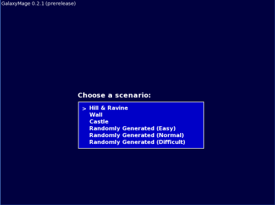

This menu lets you pick which scenario you would like to play. You can choose from some premade scenarios, or play a randomly generated scenario at the difficulty of your choice.

Use the Up and Down arrow keys to navigate the menu and Enter to make your choice.

## In the beginning...

For the purposes of this guide, the 'castle' scenario was chosen. When the scenario loads, you will be presented with this screen:

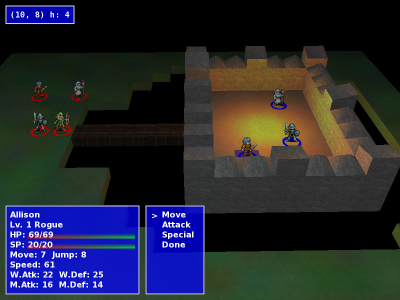

In the middle of the screen is a 3d map of the battlefield. The map is a grid made up of squares equal to about the space that one of the units takes up.

At this point, you can:

Click-and-drag with left mouse button to move the battlefield left/right/up/down.

Click-and-drag with right mouse button to rotate the battlefield around smoothly.

Press '[' / ']' or Home / End to rotate the battlefield in 45 degree incements.

Scroll the mouse wheel, or press PageUp / PageDown to zoom in and out.

Press 'R' to go back to the default view.

Press 'Q' at any time to quit the program.

Press 'W' to quit the scenario and go back to the scenario selection screen.

Or, Press 'S' to toggle sounds/music.

## The Cursor

The enemy AI may make some moves at this point, but don't worry about that just yet. When the action stops, the first thing you need to notice is the cursor. This should be a blue flashing square below one of your units.

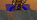

The cursor is how you make selections on the map. You can move it by using the arrow keys, however, right now you already have a unit selected. Press the Esc key now. This will deselect that unit. Move the cursor around and get the feel for it.

In the topleft area of the screen you will see the cursor coordinate box.

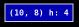

This displays the x and y coordinates of the cursor on the map, as well as its h, or height. The height's use will be explained later when we talk about units' jump attribute.

Move the cursor under any unit. When you do, The unit description box will pop up in the lower left hand corner of the screen.

## Unit Description

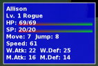

Let's take this line by line.

1. This is the unit's name. There are 3 genders in GalaxyWizard, Male, Female, and Neuter. The only effect in game is the unit's name, and its graphical representation.

2. This is the unit's level and class. Unit's gain levels by killing enemies. A class defines what abilities will be open to the unit.

3. This is the unit's HP or Hit Points. The number and graphic both indicate how much it has left. When a unit's HP reaches 0, it dies and is removed from the map.

4. This is the unit's SP or Special Points. The number and graphic both indicate how much it has left. Special Points are used up when you have a unit use a special ability (more powerful spells and attacks). We will discuss this later when we talk about Unit abilities. When a unit's SP reaches 0, it can no longer use its special abilities.

5. This line has two parts. Move, which is a number indicating how many squares this unit can move in a turn, and Jump which is a number indicating the maximum height a unit can climb from one squre to the next. ex., this unit has a jump of 8. If she is on a square of height 4, and next to her is a square of height 12, she could move on to it. But, if the square next to her was a height of 13, she couldn't move there.

6. This is the unit's speed. *What is speed?*

7. This is.. *what is it?*

8. This is.. *what is it?*

Now you are going to learn about what you can with a unit. You can either move the cursor back to the unit that was originally highlighted and press Enter, or press Esc to return to the active unit.

## Unit Actions

Before we get to that, look at the circles under each unit. If the circle is red it is an enemy unit, and if it is blue, it is a friendly unit. The arrow in the circle indicates which direction the unit is facing.

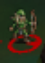

Alright, now that the active unit is highlighted, there should be a menu directly to the right of the unit description box. This is the unit action menu and looks like this:

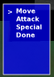

While in this menu, you can no longer move the cursor until you choose an action that requires you to use it for input. Use the Up and Down arrow keys to navigate the menu and use enter to make your selection.

At any time during a unit's turn they can:

1. Move - When you select this action, the squares that the unit can move to are highlighted with flashing light blue. You can now move the cursor to one of these squres and push Enter. If the selection was a valid squre (no other units occupy it, and it was within range) your unit will move to that new location.

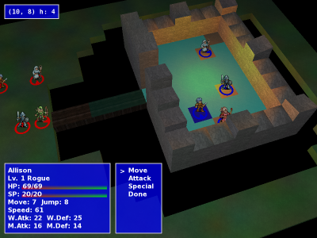

and

2. Attack or 3. Special - These are attacks. You can only do one or the other. The Attack command is a generic attack whether melee or ranged. It does not require any SP. The Special command brings up another menu so you can choose which special ability you want to use. When you Choose one of these options the squares that are within range of the attack are highlighted with flashing yellow. The targer of the attack must be within range. Move the cursor under the target and press enter. If the target is valid the attack will begin. Although I called Specials, attacks, this is only half true. Some specials can be effects (such as poison or sleep) or beneficial spells like heal in which you target an allied unit.

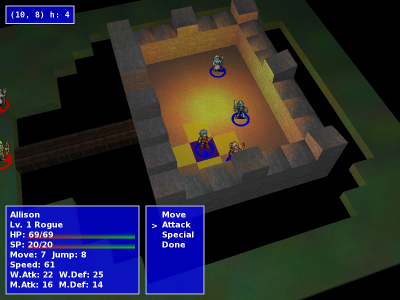

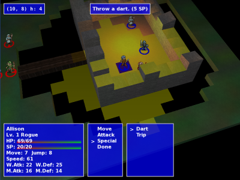

Notice that the special's description is shown at the top of the screen, including the effects and its SP price.

4. Done - use this to end this unit's turn.

While in any menu, to cancel back to the previous menu, press Esc.

## In the end...

The objective of the game is to defeat all of your enemies' units.

If you are successful, you will win.

<!-- -->

If your enemy is succesful, you lose.

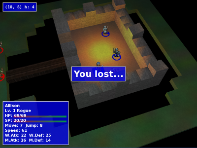

# More coming soon!
