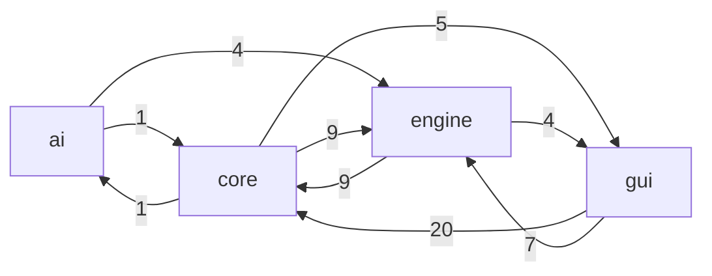

# GalaxyWizard Knowledge Graph

<!-- This file is AUTO-GENERATED by graphify.py — do not edit by hand.
     Regenerate with: poetry run galaxywizard-graphify -->

An automatically generated knowledge graph and architecture report of
the GalaxyWizard codebase. The machine-readable graph (for AI
assistants, graph databases or visualization tools) lives in
[`doc/graph/knowledge_graph.json`](graph/knowledge_graph.json);
this page is the human-readable summary. For pyreverse UML class
diagrams see [architecture.md](architecture.md).

To regenerate after changing the code:

```bash
poetry run galaxywizard-graphify
```

## Codebase at a glance

| Metric | Count |
|---|---|
| Packages | 4 |
| Modules | 37 |
| Classes | 136 |
| Top-level functions | 82 |
| Methods | 759 |
| Non-blank lines of code | 9610 |

External dependencies by importing-module count: `logging` (14), `twisted` (14), `OpenGL` (11), `pygame` (11), `random` (10), `math` (5), `time` (5), `re` (4), `os` (3), `copy` (2), `numpy` (2), `traceback` (2), `ast` (1), `builtins` (1), `gettext` (1), `optparse` (1), `platform` (1), `string` (1), `sys` (1), `zope` (1).

## Package dependencies

Import relationships aggregated to package level. An arrow
`A -->|n| B` means *n modules in A import modules in B*
(`core` groups the top-level `src/*.py` modules).



## Class inheritance

Internal class hierarchy — an arrow `Child --> Parent` means
*Child subclasses Parent*. Classes whose only base is `object` or
an external library class are omitted (external bases are listed
per class in the JSON graph).

```mermaid
graph BT
    ai_UnitAI_Base["ai.UnitAI.Base"]
    ai_UnitAI_DamageWeakest["ai.UnitAI.DamageWeakest"]
    ai_UnitAI_Exhaustive["ai.UnitAI.Exhaustive"]
    ai_UnitAI_HealWeakest["ai.UnitAI.HealWeakest"]
    ai_UnitAI_MoveToWeakest["ai.UnitAI.MoveToWeakest"]
    ai_UnitAI_TurnEvaluator["ai.UnitAI.TurnEvaluator"]
    engine_Battle_DefeatAllEnemies["engine.Battle.DefeatAllEnemies"]
    engine_Battle_EndingCondition["engine.Battle.EndingCondition"]
    engine_Battle_LastTeamStanding["engine.Battle.LastTeamStanding"]
    engine_Battle_PlayerDefeated["engine.Battle.PlayerDefeated"]
    engine_Effect_Damage["engine.Effect.Damage"]
    engine_Effect_DamageResult["engine.Effect.DamageResult"]
    engine_Effect_DamageSP["engine.Effect.DamageSP"]
    engine_Effect_DamageSPResult["engine.Effect.DamageSPResult"]
    engine_Effect_Defend["engine.Effect.Defend"]
    engine_Effect_DrainLife["engine.Effect.DrainLife"]
    engine_Effect_Effect["engine.Effect.Effect"]
    engine_Effect_EffectResult["engine.Effect.EffectResult"]
    engine_Effect_HealFriendlyDamageHostile["engine.Effect.HealFriendlyDamageHostile"]
    engine_Effect_HealResult["engine.Effect.HealResult"]
    engine_Effect_Healing["engine.Effect.Healing"]
    engine_Effect_MissResult["engine.Effect.MissResult"]
    engine_Effect_Status["engine.Effect.Status"]
    engine_Effect_StatusResult["engine.Effect.StatusResult"]
    engine_Equipment_Armor["engine.Equipment.Armor"]
    engine_Equipment_Equipment["engine.Equipment.Equipment"]
    engine_Equipment_Weapon["engine.Equipment.Weapon"]
    engine_Light_Light["engine.Light.Light"]
    engine_Light_Point["engine.Light.Point"]
    engine_Light_White["engine.Light.White"]
    engine_Range_Cross["engine.Range.Cross"]
    engine_Range_Diamond["engine.Range.Diamond"]
    engine_Range_DiamondExtend["engine.Range.DiamondExtend"]
    engine_Range_Line["engine.Range.Line"]
    engine_Range_Range["engine.Range.Range"]
    engine_Range_Single["engine.Range.Single"]
    fsm_FSM["fsm.FSM"]
    gui_Cursor_Cursor["gui.Cursor.Cursor"]
    gui_MainWindow_MainWindowDelegate["gui.MainWindow.MainWindowDelegate"]
    gui_MapEditorCursor_MapEditorCursor["gui.MapEditorCursor.MapEditorCursor"]
    gui_MapEditorGUI_MapEditorGUI["gui.MapEditorGUI.MapEditorGUI"]
    gui_MapEditorSprite_AddTagDialog["gui.MapEditorSprite.AddTagDialog"]
    gui_MapEditorSprite_Dialog["gui.MapEditorSprite.Dialog"]
    gui_MapEditorSprite_EditTagDialog["gui.MapEditorSprite.EditTagDialog"]
    gui_MapEditorSprite_FirstHeightDisplayer["gui.MapEditorSprite.FirstHeightDisplayer"]
    gui_MapEditorSprite_InputBox["gui.MapEditorSprite.InputBox"]
    gui_MapEditorSprite_SaveDialog["gui.MapEditorSprite.SaveDialog"]
    gui_MapEditorSprite_SecondHeightDisplayer["gui.MapEditorSprite.SecondHeightDisplayer"]
    gui_MapEditorSprite_TagMenu["gui.MapEditorSprite.TagMenu"]
    gui_MapEditorSprite_TagMenu2["gui.MapEditorSprite.TagMenu2"]
    gui_MapEditorSprite_ThirdHeightDisplayer["gui.MapEditorSprite.ThirdHeightDisplayer"]
    gui_MapEditorSprite_TileColorDisplayer["gui.MapEditorSprite.TileColorDisplayer"]
    gui_MapEditorSprite_TileDataDisplayer["gui.MapEditorSprite.TileDataDisplayer"]
    gui_MapEditorSprite_TileInfoDisplayer["gui.MapEditorSprite.TileInfoDisplayer"]
    gui_MapEditorSprite_TileTagDisplayer["gui.MapEditorSprite.TileTagDisplayer"]
    gui_MapEditorSprite_TileTextureDisplayer["gui.MapEditorSprite.TileTextureDisplayer"]
    gui_MapEditorSprite_TopMenu["gui.MapEditorSprite.TopMenu"]
    gui_ScenarioChooser_ScenarioChooser["gui.ScenarioChooser.ScenarioChooser"]
    gui_ScenarioChooser_ScenarioChooserFSM["gui.ScenarioChooser.ScenarioChooserFSM"]
    gui_ScenarioChooser_ScenarioChooserMenu["gui.ScenarioChooser.ScenarioChooserMenu"]
    gui_ScenarioGUI_ScenarioGUI["gui.ScenarioGUI.ScenarioGUI"]
    gui_ScenarioGUI_ScenarioGUIFSM["gui.ScenarioGUI.ScenarioGUIFSM"]
    gui_Sprite_Animation["gui.Sprite.Animation"]
    gui_Sprite_AttackDisplayer["gui.Sprite.AttackDisplayer"]
    gui_Sprite_BattleMenu["gui.Sprite.BattleMenu"]
    gui_Sprite_CursorPosnDisplayer["gui.Sprite.CursorPosnDisplayer"]
    gui_Sprite_DamageDisplayer["gui.Sprite.DamageDisplayer"]
    gui_Sprite_FPSDisplayer["gui.Sprite.FPSDisplayer"]
    gui_Sprite_SpecialMenu["gui.Sprite.SpecialMenu"]
    gui_Sprite_Sprite["gui.Sprite.Sprite"]
    gui_Sprite_TextDisplayer["gui.Sprite.TextDisplayer"]
    gui_Sprite_TextDisplayerBox["gui.Sprite.TextDisplayerBox"]
    gui_Sprite_TextEntry["gui.Sprite.TextEntry"]
    gui_Sprite_TextMenu["gui.Sprite.TextMenu"]
    gui_Sprite_UnitBarDisplayer["gui.Sprite.UnitBarDisplayer"]
    gui_Sprite_UnitClassDisplayer["gui.Sprite.UnitClassDisplayer"]
    gui_Sprite_UnitDisplayer["gui.Sprite.UnitDisplayer"]
    gui_Sprite_UnitHPDisplayer["gui.Sprite.UnitHPDisplayer"]
    gui_Sprite_UnitMagicalDisplayer["gui.Sprite.UnitMagicalDisplayer"]
    gui_Sprite_UnitMovementDisplayer["gui.Sprite.UnitMovementDisplayer"]
    gui_Sprite_UnitNameDisplayer["gui.Sprite.UnitNameDisplayer"]
    gui_Sprite_UnitPhysicalDisplayer["gui.Sprite.UnitPhysicalDisplayer"]
    gui_Sprite_UnitSPDisplayer["gui.Sprite.UnitSPDisplayer"]
    gui_Sprite_UnitSpeedDisplayer["gui.Sprite.UnitSpeedDisplayer"]
    gui_Sprite_UnitStatsDisplayer["gui.Sprite.UnitStatsDisplayer"]
    twistedmain_AIClient["twistedmain.AIClient"]
    twistedmain_AIFSM["twistedmain.AIFSM"]
    twistedmain_GameClient["twistedmain.GameClient"]
    twistedmain_GameCreator["twistedmain.GameCreator"]
    twistedmain_GameObserver["twistedmain.GameObserver"]
    twistedmain_GamePlayer["twistedmain.GamePlayer"]
    twistedmain_InteractiveClient["twistedmain.InteractiveClient"]
    ai_UnitAI_DamageWeakest --> ai_UnitAI_TurnEvaluator
    ai_UnitAI_Exhaustive --> ai_UnitAI_Base
    ai_UnitAI_HealWeakest --> ai_UnitAI_TurnEvaluator
    ai_UnitAI_MoveToWeakest --> ai_UnitAI_TurnEvaluator
    engine_Battle_DefeatAllEnemies --> engine_Battle_EndingCondition
    engine_Battle_LastTeamStanding --> engine_Battle_EndingCondition
    engine_Battle_PlayerDefeated --> engine_Battle_EndingCondition
    engine_Effect_Damage --> engine_Effect_Effect
    engine_Effect_DamageResult --> engine_Effect_EffectResult
    engine_Effect_DamageSP --> engine_Effect_Effect
    engine_Effect_DamageSPResult --> engine_Effect_EffectResult
    engine_Effect_Defend --> engine_Effect_Effect
    engine_Effect_DrainLife --> engine_Effect_Effect
    engine_Effect_HealFriendlyDamageHostile --> engine_Effect_Effect
    engine_Effect_HealResult --> engine_Effect_EffectResult
    engine_Effect_Healing --> engine_Effect_Effect
    engine_Effect_MissResult --> engine_Effect_EffectResult
    engine_Effect_Status --> engine_Effect_Effect
    engine_Effect_StatusResult --> engine_Effect_EffectResult
    engine_Equipment_Armor --> engine_Equipment_Equipment
    engine_Equipment_Weapon --> engine_Equipment_Equipment
    engine_Light_Point --> engine_Light_Light
    engine_Light_White --> engine_Light_Light
    engine_Range_Cross --> engine_Range_Range
    engine_Range_Diamond --> engine_Range_Range
    engine_Range_DiamondExtend --> engine_Range_Diamond
    engine_Range_Line --> engine_Range_Range
    engine_Range_Single --> engine_Range_Range
    gui_Cursor_Cursor --> gui_Sprite_Sprite
    gui_MapEditorCursor_MapEditorCursor --> gui_Sprite_Sprite
    gui_MapEditorGUI_MapEditorGUI --> gui_MainWindow_MainWindowDelegate
    gui_MapEditorSprite_AddTagDialog --> gui_MapEditorSprite_Dialog
    gui_MapEditorSprite_Dialog --> gui_Sprite_TextDisplayerBox
    gui_MapEditorSprite_EditTagDialog --> gui_MapEditorSprite_Dialog
    gui_MapEditorSprite_FirstHeightDisplayer --> gui_MapEditorSprite_TileDataDisplayer
    gui_MapEditorSprite_InputBox --> gui_Sprite_TextDisplayer
    gui_MapEditorSprite_SaveDialog --> gui_MapEditorSprite_Dialog
    gui_MapEditorSprite_SecondHeightDisplayer --> gui_MapEditorSprite_TileDataDisplayer
    gui_MapEditorSprite_TagMenu --> gui_Sprite_TextMenu
    gui_MapEditorSprite_TagMenu2 --> gui_Sprite_TextMenu
    gui_MapEditorSprite_ThirdHeightDisplayer --> gui_MapEditorSprite_TileDataDisplayer
    gui_MapEditorSprite_TileColorDisplayer --> gui_MapEditorSprite_TileDataDisplayer
    gui_MapEditorSprite_TileDataDisplayer --> gui_Sprite_TextDisplayer
    gui_MapEditorSprite_TileInfoDisplayer --> gui_Sprite_TextDisplayerBox
    gui_MapEditorSprite_TileTagDisplayer --> gui_MapEditorSprite_TileDataDisplayer
    gui_MapEditorSprite_TileTextureDisplayer --> gui_MapEditorSprite_TileDataDisplayer
    gui_MapEditorSprite_TopMenu --> gui_Sprite_TextMenu
    gui_ScenarioChooser_ScenarioChooser --> gui_MainWindow_MainWindowDelegate
    gui_ScenarioChooser_ScenarioChooserFSM --> fsm_FSM
    gui_ScenarioChooser_ScenarioChooserMenu --> gui_Sprite_TextMenu
    gui_ScenarioGUI_ScenarioGUI --> gui_MainWindow_MainWindowDelegate
    gui_ScenarioGUI_ScenarioGUIFSM --> fsm_FSM
    gui_Sprite_Animation --> gui_Sprite_Sprite
    gui_Sprite_AttackDisplayer --> gui_Sprite_Animation
    gui_Sprite_BattleMenu --> gui_Sprite_TextMenu
    gui_Sprite_CursorPosnDisplayer --> gui_Sprite_TextDisplayer
    gui_Sprite_DamageDisplayer --> gui_Sprite_Animation
    gui_Sprite_FPSDisplayer --> gui_Sprite_TextDisplayer
    gui_Sprite_SpecialMenu --> gui_Sprite_TextMenu
    gui_Sprite_TextDisplayer --> gui_Sprite_Sprite
    gui_Sprite_TextDisplayerBox --> gui_Sprite_Sprite
    gui_Sprite_TextEntry --> gui_Sprite_TextDisplayer
    gui_Sprite_TextMenu --> gui_Sprite_Sprite
    gui_Sprite_UnitBarDisplayer --> gui_Sprite_Sprite
    gui_Sprite_UnitClassDisplayer --> gui_Sprite_UnitStatsDisplayer
    gui_Sprite_UnitDisplayer --> gui_Sprite_Sprite
    gui_Sprite_UnitHPDisplayer --> gui_Sprite_UnitStatsDisplayer
    gui_Sprite_UnitMagicalDisplayer --> gui_Sprite_UnitStatsDisplayer
    gui_Sprite_UnitMovementDisplayer --> gui_Sprite_UnitStatsDisplayer
    gui_Sprite_UnitNameDisplayer --> gui_Sprite_UnitStatsDisplayer
    gui_Sprite_UnitPhysicalDisplayer --> gui_Sprite_UnitStatsDisplayer
    gui_Sprite_UnitSPDisplayer --> gui_Sprite_UnitStatsDisplayer
    gui_Sprite_UnitSpeedDisplayer --> gui_Sprite_UnitStatsDisplayer
    gui_Sprite_UnitStatsDisplayer --> gui_Sprite_TextDisplayer
    twistedmain_AIClient --> twistedmain_GameClient
    twistedmain_AIFSM --> fsm_FSM
    twistedmain_GameCreator --> twistedmain_GamePlayer
    twistedmain_GamePlayer --> twistedmain_GameObserver
    twistedmain_InteractiveClient --> twistedmain_GameClient
```



## Key modules

Modules ranked by how many other modules import them (fan-in) —
changes here have the widest impact.

| Module | Imported by | Imports | Classes | LOC |
|---|---|---|---|---|
| `resources` | 14 | 8 | 13 | 482 |
| `gui.Sprite` | 9 | 8 | 23 | 910 |
| `constants` | 9 | 0 | 0 | 9 |
| `gui.ScenarioGUI` | 7 | 15 | 2 | 793 |
| `engine.Faction` | 7 | 0 | 1 | 50 |
| `gui.Input` | 7 | 0 | 2 | 284 |
| `engine.Effect` | 6 | 4 | 14 | 366 |
| `gui.GLUtil` | 6 | 4 | 0 | 619 |
| `gui.MainWindow` | 5 | 6 | 2 | 197 |
| `engine.Unit` | 5 | 5 | 2 | 441 |

## Module inventory

### `ai` (src/ai)

| Module | Classes | LOC | Summary |
|---|---|---|---|
| `ai.UnitAI` | TemporaryUnitPosition, Base, TurnEvaluator, HealWeakest, Da… | 436 | AI system for computer-controlled units in GalaxyWizard. |

### `core` (src)

| Module | Classes | LOC | Summary |
|---|---|---|---|
| `constants` |  | 9 |  |
| `fsm` | FSM | 44 |  |
| `log` | CustomLogger | 17 |  |
| `main` |  | 40 |  |
| `resources` | FontLoader, MapLoader, ImageLoader, TextureLoader, Scenario… | 482 |  |
| `sound` |  | 57 |  |
| `translate` | Translate | 28 |  |
| `twistedmain` | Access, GameObserver, GamePlayer, GameCreator, GameClient, … | 614 |  |
| `util` | Lock | 21 |  |

### `engine` (src/engine)

| Module | Classes | LOC | Summary |
|---|---|---|---|
| `engine.Ability` | Ability | 115 |  |
| `engine.Battle` | Battle, UnitTurn, EndingCondition, DefeatAllEnemies, Player… | 291 |  |
| `engine.Class` | Class | 118 |  |
| `engine.Effect` | Effect, EffectResult, MissResult, DamageResult, DamageSPRes… | 366 |  |
| `engine.Equipment` | Equipment, Weapon, Armor | 88 |  |
| `engine.Faction` | Faction | 50 |  |
| `engine.Light` | Light, Foo, White, Point, Environment | 133 |  |
| `engine.Map` | MapSquare, Map, MapIO | 928 |  |
| `engine.MapGenerator` |  | 391 |  |
| `engine.Name` |  | 51 |  |
| `engine.Range` | Range, Line, Cross, Diamond, DiamondExtend, Single | 109 |  |
| `engine.Scenario` | Scenario, ScenarioIO | 155 |  |
| `engine.Unit` | Unit, StatusEffects | 441 |  |
| `engine.netsupport` |  | 44 |  |

### `gui` (src/gui)

| Module | Classes | LOC | Summary |
|---|---|---|---|
| `gui.Camera` | Camera | 222 |  |
| `gui.Clock` | Clock | 54 |  |
| `gui.Cursor` | Cursor | 102 |  |
| `gui.GLUtil` |  | 619 |  |
| `gui.Geometry` | Point3D | 31 |  |
| `gui.Input` | Event, Input | 284 |  |
| `gui.MainWindow` | MainWindow, MainWindowDelegate | 197 |  |
| `gui.MapEditorCursor` | MapEditorCursor | 308 |  |
| `gui.MapEditorGUI` | MapEditorGUI | 471 |  |
| `gui.MapEditorSprite` | TileDataDisplayer, TileColorDisplayer, TileTextureDisplayer… | 440 |  |
| `gui.ScenarioChooser` | ScenarioChooser, ScenarioChooserMenu, ScenarioChooserFSM | 151 |  |
| `gui.ScenarioGUI` | ScenarioGUI, ScenarioGUIFSM | 793 |  |
| `gui.Sprite` | Sprite, UnitDisplayer, TextDisplayer, FPSDisplayer, CursorP… | 910 |  |
