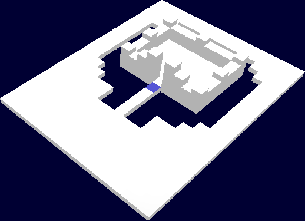
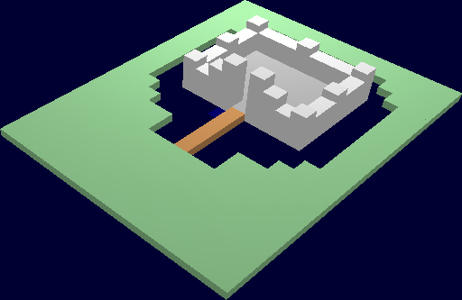
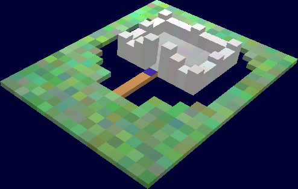
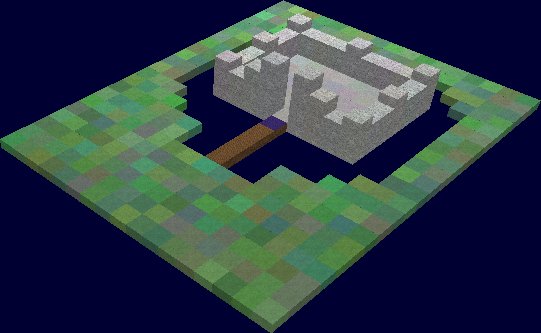
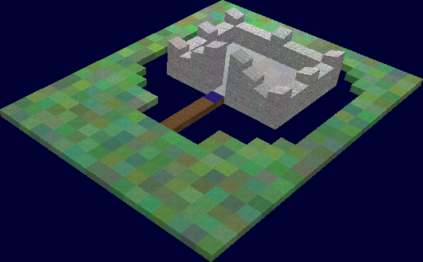

# Map File Format

Maps are stored in a data/*/maps directory, and must have a filename ending in ".py". To load a map at the command-line, use the "-m" option, then give the name of the map without the .py ending. So something like:

```
GalaxyWizard.py -m castle-1
```

Each map file is actually written in the Python language, which is just done for convenience (it makes loading the maps a snap). So it might help to get a text editor that supports Python syntax highlighting, as it will be easier to notice if you make some sort of error.

This document walks you through the process of building a map from the ground up -- starting by specifying tile heights, then adding colors, textures, and so on. We'll be using the files `data/demo/maps/castle*.py` as examples. It would be best if you open up these files (in your text editor) when we mention them, so that you can follow along more easily.

## A very simple map

The file demo-castle-1.py contains a very simple map. This is what the entire file looks like:

```python
# MAP DATA

# Version of the map file format
VERSION = 1

# Width and height of the map
WIDTH = 17
HEIGHT = 22

# Layout of map tiles
LAYOUT = '''
4   4   4   4   4   4   4   4   4   4   4   4   4   4   4   4   4
4   4   4   4   4   4   4   4   4   4   4   4   4   4   4   4   4
4   4   4   4   0   0   0   0   0   0   0   0   0   4   4   4   4
4   4   4   0   0   0   0   0   0   0   0   0   0   0   4   4   4
4   4   0   0   18  14  14  14  18  14  14  14  18  0   0   4   4
4   4   0   0   14  4   4   4   4   4   4   4   14  0   0   4   4
4   4   0   0   14  4   4   4   4   4   4   4   14  0   0   4   4
4   4   0   0   18  4   4   4   4   4   4   4   18  0   0   4   4
4   4   0   0   14  4   4   4   4   4   4   4   14  0   0   4   4
4   4   0   0   14  4   4   4   4   4   4   4   14  0   0   4   4
4   4   0   0   18  14  20  26  4   26  20  14  18  0   0   4   4
4   4   0   0   0   0   0   0   4   0   0   0   0   0   0   4   4
4   4   4   0   0   0   0   0   4   0   0   0   0   0   4   4   4
4   4   4   4   0   0   0   0   4   0   0   0   0   4   4   4   4
4   4   4   4   4   4   0   0   4   0   0   4   4   4   4   4   4
4   4   4   4   4   4   0   0   4   0   0   4   4   4   4   4   4
4   4   4   4   4   4   4   4   4   4   4   4   4   4   4   4   4
4   4   4   4   4   4   4   4   4   4   4   4   4   4   4   4   4
4   4   4   4   4   4   4   4   4   4   4   4   4   4   4   4   4
4   4   4   4   4   4   4   4   4   4   4   4   4   4   4   4   4
4   4   4   4   4   4   4   4   4   4   4   4   4   4   4   4   4
4   4   4   4   4   4   4   4   4   4   4   4   4   4   4   4   4
'''
```

This is the minimum that a map file can have. Here's some more details:

- VERSION gives the version number of the map file format - always set this to 1.

- WIDTH and HEIGHT are the width and height of the map.

- The LAYOUT section contains one row of the map per line. Each tile in that row is given as a number, which is the height of that tile. Tiles are separated by one or more spaces. Tiles with height 0 won't be drawn, and no units will be able to move into these spaces. 8 height units is visually equal to one tile -- so a tile that has a height 8 higher than its neighbors will look like a cube. As a rule of thumb, most units will have jump values in the range 6-8, which means that they can move up/down 6-8 height units from one tile to the next.

You can also see that you can add comments to your map files, which might help you remember what you're up to. This file is pretty simple, so it probably doesn't need comments, but once we get to more complicated maps you might see why you'd want comments.

If you run this map with `GalaxyWizard.py -m castle-1`, you'll see what it looks like: a flat field with a castle in the middle (and a little void for a moat).



But it's a pretty boring map; everything is white. So let's spruce it up a bit so that it looks much nicer.

## Adding color to the map

In the file castle-2.py, we'll see how to add color. The first new thing you should notice is the following chunk:

```python
# Tile properties
TILE_PROPERTIES = {
    'w': { 'color': (0.8, 0.8, 0.8, 1.0) },
    'g': { 'color': (0.6, 0.6, 0.6, 1.0) },
    't': { 'color': (0.7, 0.5, 0.3, 1.0) },
    '':  { 'color': (0.5, 0.7, 0.5, 1.0) },
    }
```

You'll also notice that some of the tiles in the LAYOUT section have letters after the numbers, like this:

```
14w 4g  4g  4g  4g  4g  4g  4g  14w
```

This letter is a "tag" that tells the map loader which properties to apply to the tile. It reads these properties out of the TILE_PROPERTIES section. For instance, anything tagged with the letter "w" will have a color (0.8, 0.8, 0.8, 1.0) -- basically, a white color. Likewise, the "g" tag creates a grey tile and the "t" tag creates a tan tile. Anything that doesn't have a tag gets a default value from the last line -- the one that starts with '': . It turns out that this is a green color.

A word about colors: the 4 values there are (red, green, blue, alpha), all in the range 0.0 to 1.0. You should always set alpha to 1.0 for now. Eventually this value might let you define translucent map tiles, but for now it's not implemented correctly (and probably won't be for a while, if ever.)

Though all the tags in this example are single characters, you can use strings of multiple characters if you want. This might become more useful when you get to more complicated maps.

Go ahead and run this map and see what it looks like.



### Adding color variance

Now, onto castle-3.py, where we'll spruce things up just a bit more. Nothing's changed here except tile properties, where you can see that every tag has a new property defined:

```python
TILE_PROPERTIES = {
    'w': { 'color': (0.8, 0.8, 0.8, 1.0),
           'colorVar': (0.05, 0.05, 0.05, 0.0) },
    'g': { 'color': (0.6, 0.6, 0.6, 1.0),
           'colorVar': (0.05, 0.05, 0.05, 0.0) },
    't': { 'color': (0.7, 0.5, 0.3, 1.0) },
    '':  { 'color': (0.5, 0.7, 0.5, 1.0),
           'colorVar': (0.2, 0.2, 0.2, 0.0) },
    }
```

This adds some random variation to the colors of the tiles that have that tag. Basically, each color component has a random amount subtracted from the value specified in 'color'. So for our example, the tiles tagged with "g" will now have color values randomly selected from the range (0.55 - 0.6). The colorVar is set to 0.2 for the default (green) tiles, so their color will vary a lot more than the castle tiles. Note also that we didn't add a 'colorVar' property to the 't' tag, so tiles tagged with 't' will have no variance.



## Adding textures

Onto castle-4.py, where we make things look much nicer by adding textures. This is really simple: we just add another new field to the TILE_PROPERTIES structure:

```python
TILE_PROPERTIES = {
    'w': { 'color': (0.8, 0.8, 0.8, 1.0),
           'colorVar': (0.05, 0.05, 0.05, 0.0),
           'texture': 'stone' },
    'g': { 'color': (0.6, 0.6, 0.6, 1.0),
           'colorVar': (0.05, 0.05, 0.05, 0.0),
           'texture': 'marble-slight' },
    't': { 'color': (0.7, 0.5, 0.3, 1.0),
           'texture': 'wood' },
    '':  { 'color': (0.5, 0.7, 0.5, 1.0),
           'colorVar': (0.2, 0.2, 0.2, 0.0),
           'texture': 'grass' },
    }
```

These textures are loaded from the data/*/textures directories. Each file is a 128x128 PNG image. Feel free to make your own textures and use them in your maps. It's recommended, but not required, that you make textures in grayscale - that way you can add them to a map tile of any color without it looking too weird. Otherwise, the map tile will get some of its color from the texture that is applied to it.



## Advanced map-making

That's all you need to start making basic maps. The only other thing that's supported -- but that I haven't covered yet -- is how to set the heights of each tile corner individually. I'll write a more detailed explanation of that eventually, but for now you can look at the final file, castle.py, to see how to do it.



castle.py also shows how you can define constants, like

```python
white = (0.8, 0.8, 0.8, 1.0)
```

This makes the map file slightly easier to read. More importantly, if you define and use the `white` constant for all your white tiles, you can adjust the color in just one place and have that change automatically applied to all white tiles.
